<div align="center">


<br /><br />

# Tranche

**Invoice discounting with an allocation engine built for concurrency, not CRUD.**

[](https://github.com/vamshiganesh/Tranche/actions/workflows/ci.yml)


<br />

**[Live frontend](https://tranche-six.vercel.app/)** &nbsp;·&nbsp; **[Swagger UI](http://localhost:8080/swagger-ui.html)** (local) &nbsp;·&nbsp; **[Demo script](docs/demo-script.md)** &nbsp;·&nbsp; **[Architecture](docs/architecture.md)**

<br />

*When ten investors hit the same invoice opportunity at the same millisecond,<br />most backends race. Tranche does not.*

</div>

<br />

## Table of Contents

1. [Preview](#preview)
2. [The story behind Tranche](#the-story-behind-tranche)
3. [What Tranche does](#what-tranche-does)
4. [By the numbers](#by-the-numbers)
5. [Product tour](#product-tour)
6. [How the hard part works](#how-the-hard-part-works)
7. [Opportunity lifecycle](#opportunity-lifecycle)
8. [Architecture](#architecture)
9. [Onboarding and trust gates](#onboarding-and-trust-gates)
10. [Technology stack](#technology-stack)
11. [Testing and quality](#testing-and-quality)
12. [Getting started](#getting-started)
13. [Demo accounts](#demo-accounts)
14. [Documentation map](#documentation-map)
15. [License](#license)

<br />

## Preview

<div align="center">

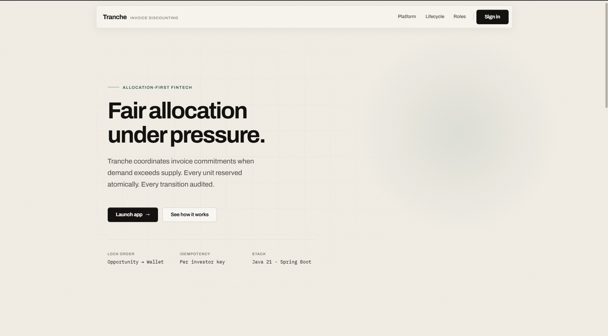

<br /><br />

**Vercel (frontend):** [https://tranche-six.vercel.app/](https://tranche-six.vercel.app/)

<br />

*The live deployment showcases the UI and landing experience. Connect the Spring Boot API locally for the full lifecycle demo.*

</div>

<br />

## The story behind Tranche

Picture a marketplace where a popular invoice pool has **15 units left** and **two investors** submit commitments in the same breath. A naive system reads the same remaining count twice, allocates both, and quietly overbooks. Money moves. Compliance asks questions. Trust erodes.

Tranche exists to solve that moment.

I did not set out to build another invoice listing page. I set out to build an **allocation engine**: a backend where concurrent commitments are serialized correctly, wallets lock in the same transaction as unit reservation, partial fills are honest, retries are idempotent, and every transition leaves an immutable audit trail.

The React frontend is the window into that engine. Three role workspaces (issuer, investor, admin) sit on top of one domain model. The story you see in the UI is backed by pessimistic locking, a strict opportunity state machine, and integration tests that race twenty threads against the same opportunity.

<br />

## What Tranche does

Tranche is an **invoice discounting platform**. Businesses (issuers) publish receivable opportunities. Investors commit funds in discrete units. Operators (admins) review, publish, and drive opportunities from draft to settlement.

| Actor | What they experience |
|:------|:--------------------|
| **Issuer** | Create invoice opportunities, submit for review, track subscription progress |
| **Investor** | Browse live deals, commit units from a wallet, monitor portfolio through maturity |
| **Admin** | Review queue, onboarding approvals (KYC/KYB), lifecycle transitions, audit inspection |

Under the hood, the product is a **modular monolith**: eight bounded modules in one deployable JAR, sharing MariaDB and Redis, with microservice style boundaries and monolith simplicity.

<br />

## By the numbers

| Metric | Value |
|:-------|:------|
| Automated tests | **79** (CI on every push to `main`) |
| Integration test classes | **28** |
| REST controllers | **9** |
| Domain modules | **8** (auth, issuer, investor, opportunity, allocation, portfolio, audit, notification) |
| Flyway migrations | **6** |
| Opportunity lifecycle states | **7** (draft through settled) |
| Concurrent allocation stress test | **20 threads** on one opportunity |
| Seeded investor wallet (demo) | **$3,000,000** per account |
| API idempotency | Header based replay safe commitments |
| Frontend stack | React 19 · Vite · TypeScript |

<br />

## Product tour

### ◈ Landing and positioning

The public surface explains *why* allocation correctness matters before anyone signs in. Editorial typography, lifecycle storytelling, and role based workspaces set context for technical reviewers and recruiters alike.

<table>
  <tr>
    <td align="center" width="50%">
      <b>Hero</b><br /><br />
      
    </td>
    <td align="center" width="50%">
      <b>Built for the hard part</b><br /><br />
      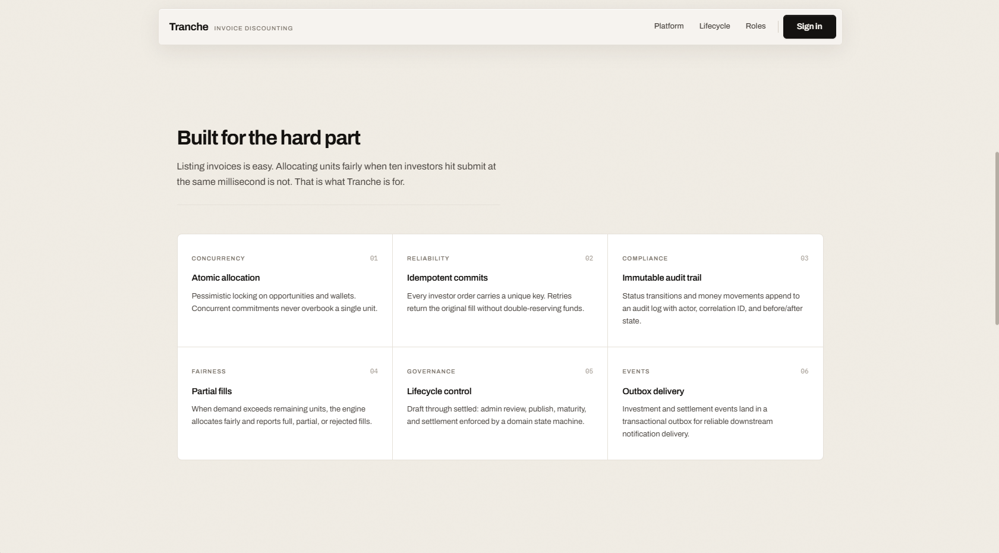
    </td>
  </tr>
  <tr>
    <td align="center" colspan="2">
      <b>Three workspaces, one platform</b><br /><br />
      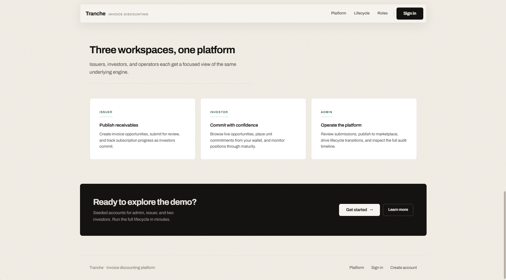
    </td>
  </tr>
</table>

<br />

### ◈ Authentication

JWT based sign in with role aware routing. Registration includes email verification, password policy enforcement, and separate onboarding paths for investors and issuers.

<div align="center">

<table>
  <tr>
    <td align="center" width="70%">
      <b>Sign in</b><br /><br />
      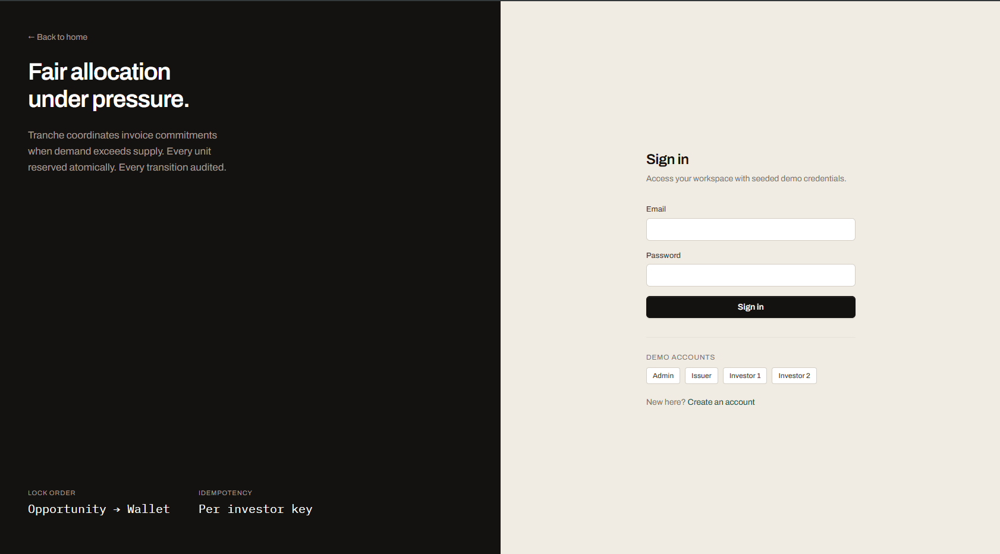
    </td>
  </tr>
</table>

</div>

<br />

### ◈ Role workspaces

Each role sees only what they need. Same engine, different lens.

<table>
  <tr>
    <td align="center" width="33%">
      <b>Admin · Operations</b><br /><br />
      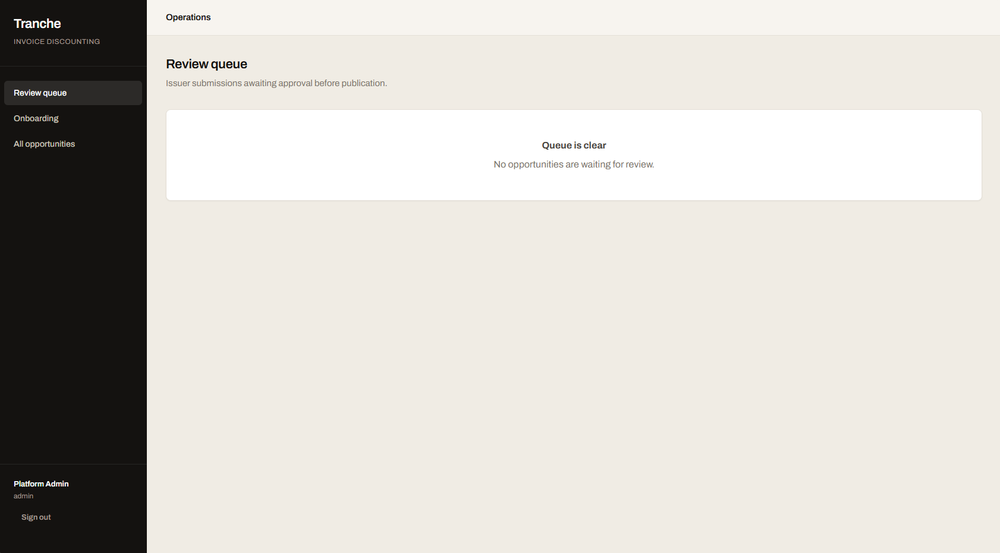
      <br /><br />
      Review queue, onboarding approvals, lifecycle control, audit timeline
    </td>
    <td align="center" width="33%">
      <b>Investor · Marketplace</b><br /><br />
      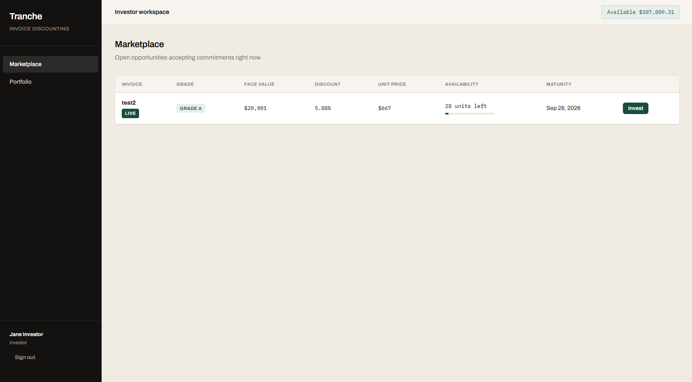
      <br /><br />
      Live opportunities, unit commitments, portfolio positions
    </td>
    <td align="center" width="33%">
      <b>Issuer · Receivables</b><br /><br />
      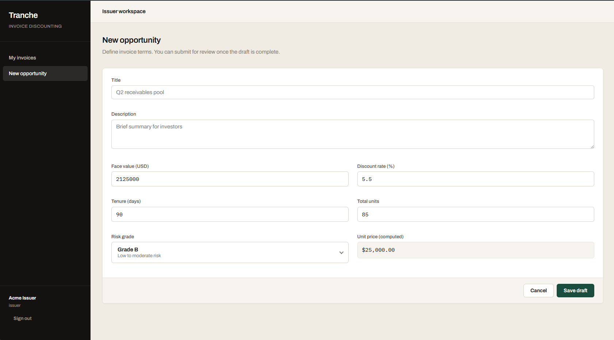
      <br /><br />
      Draft opportunities, KYB onboarding, submission tracking
    </td>
  </tr>
</table>

<br />

## How the hard part works

Most marketplaces optimize for listing and search. Tranche optimizes for **the commit path**: the narrow window where money and inventory must move atomically.

**Concurrency.** The opportunity row is locked first (`SELECT … FOR UPDATE`). Only then is the investor wallet locked. Fixed lock ordering prevents deadlocks. Unit decrement, fund reservation, audit write, and outbox event share one transaction.

**Idempotency.** Every commitment carries an `Idempotency-Key`. Retries return the original order (HTTP 200) instead of double allocating (HTTP 201 on first success).

**Partial fills.** When demand exceeds remaining units, the engine allocates what is left and reports `PARTIAL` honestly. No silent overbooking.

**Auditability.** Status changes and money movements append to an immutable log: actor, correlation ID, before/after state.

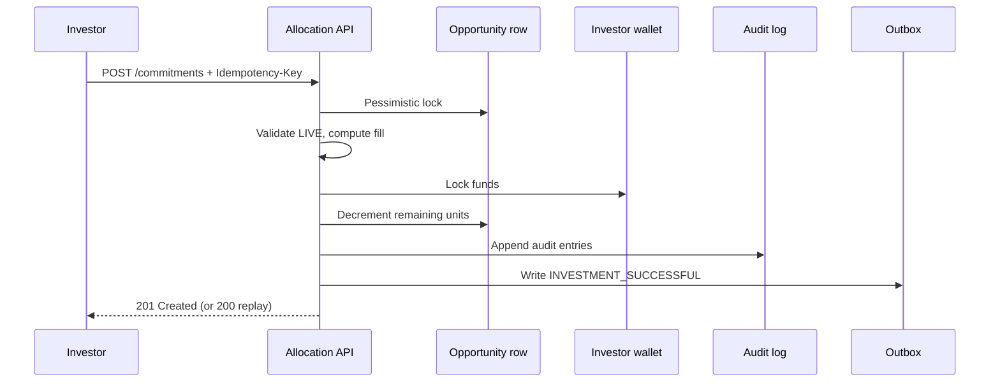

<br />

## Opportunity lifecycle

Invalid transitions are rejected at the domain layer before they reach persistence. Only **LIVE** opportunities accept commitments.

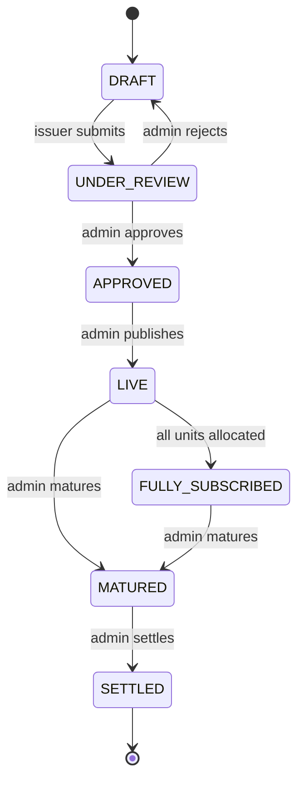

| State | Meaning |
|:------|:--------|
| `DRAFT` | Issuer editing; hidden from investors |
| `UNDER_REVIEW` | Awaiting admin decision |
| `APPROVED` | Cleared for publish |
| `LIVE` | Open for commitments |
| `FULLY_SUBSCRIBED` | No units remaining |
| `MATURED` | Tenure elapsed |
| `SETTLED` | Terminal; funds distributed |

<br />

## Architecture

Tranche is a **modular monolith**: one process, clear module boundaries, shared schema, extraction ready design.

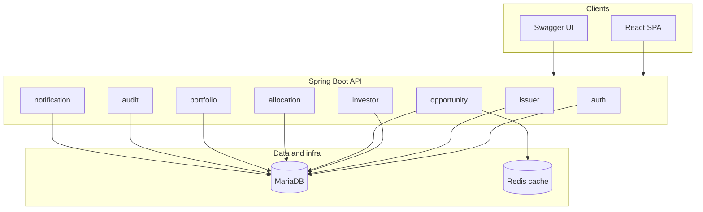

| Module | Responsibility |
|:-------|:---------------|
| `auth` | JWT, registration, email verification, RBAC |
| `issuer` | Company profile, KYB status, issuer scoped actions |
| `investor` | Wallet balance, fund locking, KYC gates |
| `opportunity` | CRUD, lifecycle state machine, marketplace listing |
| `allocation` | Commitment intake, idempotency, unit allocation engine |
| `portfolio` | Positions, expected return, maturity views |
| `audit` | Append only audit timeline |
| `notification` | Transactional outbox (mock dispatch in demo) |

**Cross module rule:** repositories stay private; modules call each other's **service** layer only.

Deep dive: [docs/architecture.md](docs/architecture.md) · [docs/allocation-engine.md](docs/allocation-engine.md)

<br />

## Onboarding and trust gates

Demo complete onboarding without third party vendors. Gates are real; delivery is stubbed for local development.

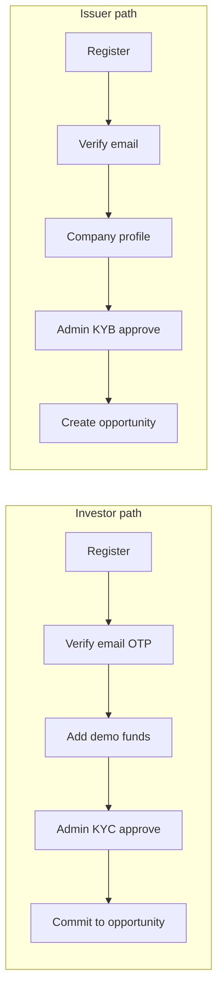

Full reference: [docs/onboarding.md](docs/onboarding.md)

<br />

## Technology stack

| Layer | Choices |
|:------|:--------|
| **Runtime** | Java 21 |
| **Backend** | Spring Boot 3.4 · Spring Security · Spring Data JPA |
| **Database** | MariaDB 11 · Flyway migrations |
| **Cache** | Redis 7 · cache aside opportunity listings |
| **Auth** | JWT bearer tokens · BCrypt |
| **API docs** | SpringDoc OpenAPI · Swagger UI (dev profile) |
| **Frontend** | React 19 · Vite · TypeScript · Framer Motion · Lenis |
| **Testing** | JUnit 5 · Testcontainers · Spring MockMvc |
| **CI** | GitHub Actions · `./mvnw test` |
| **Local infra** | Docker Compose |

<br />

## Testing and quality

Correctness is not asserted in prose alone. The test suite proves it.

| Test suite | What it proves |
|:-----------|:---------------|
| `ConcurrentCommitmentIntegrationTest` | 20 parallel threads never over allocate |
| `InvestorRaceHttpIntegrationTest` | HTTP level two investor race |
| `PartialFillIntegrationTest` | Honest partial fills when demand exceeds supply |
| `IdempotencyIntegrationTest` | Replay returns same order without double spend |
| `OpportunityLifecycleIntegrationTest` | Draft to settled with invalid transition guards |
| `OnboardingIntegrationTest` | Email verify, KYC/KYB, resubmit flows |
| `AllocationCalculatorTest` | Pure allocation math isolated from I/O |

```bash
./mvnw test
```

Requires Docker for Testcontainers (MariaDB + Redis). Tests skip gracefully when Docker is unavailable locally; CI runs the full **79** tests on every push.

<br />

## Getting started

### Prerequisites

| Tool | Purpose |
|:-----|:--------|
| Java 21 | Run the API |
| Docker | MariaDB, Redis, Testcontainers |
| Node.js 20+ | Frontend dev server |
| `./mvnw` | Included Maven wrapper (no global Maven required) |

### 1 · Start infrastructure

```bash
docker compose up -d
```

### 2 · Run the API

```bash
./mvnw spring-boot:run
```

Flyway applies migrations and seed data on startup. Health check:

```bash
curl -s http://localhost:8080/actuator/health
```

Swagger UI (dev profile): [http://localhost:8080/swagger-ui.html](http://localhost:8080/swagger-ui.html)

### 3 · Run the frontend

```bash
cd frontend
npm install
npm run dev
```

Open [http://localhost:5173](http://localhost:5173). Vite proxies `/api` to port 8080.

### 4 · Load demo tokens (optional)

```bash
source scripts/demo-env.sh
```

### End to end demo (5 minutes)

1. Sign in as **issuer** → submit seeded opportunity for review  
2. Sign in as **admin** → approve and publish  
3. Open two browser windows as **investor1** and **investor2** → race for remaining units  
4. Inspect portfolio and admin audit timeline  
5. Mature and settle the opportunity  

Scripted walkthrough: [docs/demo-script.md](docs/demo-script.md) · curl recipes: [docs/demo-flow.md](docs/demo-flow.md)

<br />

## Demo accounts

Password for all seeded users: **`Password123!`**

| Email | Role | Notes |
|:------|:-----|:------|
| `admin@tranche.local` | Admin | Review queue, onboarding, lifecycle |
| `issuer@tranche.local` | Issuer | KYB approved; demo opportunity in DRAFT |
| `investor1@tranche.local` | Investor | $3M wallet; KYC approved |
| `investor2@tranche.local` | Investor | $3M wallet; use for race demos |

New users can register at `/register` (email OTP appears in API logs during local dev).

<br />

## Documentation map

| Document | Contents |
|:---------|:---------|
| [docs/architecture.md](docs/architecture.md) | Layering, locking, caching, security |
| [docs/allocation-engine.md](docs/allocation-engine.md) | Commitment path deep dive |
| [docs/audit-and-outbox.md](docs/audit-and-outbox.md) | Audit queries, outbox poller |
| [docs/onboarding.md](docs/onboarding.md) | Register, OTP, KYC/KYB, demo funds |
| [docs/demo-script.md](docs/demo-script.md) | Timed interview walkthrough |
| [docs/demo-flow.md](docs/demo-flow.md) | curl race and idempotency recipes |
| [docs/api-contract.md](docs/api-contract.md) | REST endpoint reference |
| [docs/final-review-notes.md](docs/final-review-notes.md) | Tradeoffs and interview talking points |
| [frontend/README.md](frontend/README.md) | UI workflows by role |

<br />

## Why this project exists

Invoice discounting is a credible fintech domain. The engineering story is universal: **how do you move inventory and money under contention without lying to anyone?**

Tranche is my answer in code: pessimistic locks where they matter, idempotency where networks flake, audit logs where regulators ask, and tests that race threads because slides are not proof.

If you are reviewing this repository for a role on a backend, platform, or fintech team: start with the [allocation engine doc](docs/allocation-engine.md), run `./mvnw test`, then spend five minutes on the [live UI](https://tranche-six.vercel.app/). The landing page is the pitch. The tests are the evidence.

<br />

<div align="center">

**Built with care for correctness first, demo second, vanity never.**

<br />

MIT License · [vamshiganesh/Tranche](https://github.com/vamshiganesh/Tranche)

</div>
