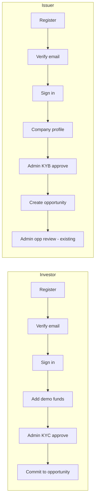

# Onboarding

Demo-complete onboarding for new investors and issuers. Production integrations (real email delivery, KYC vendors, payment rails) are stubbed; gates and audit trails are real.

## Flow overview



## Investor path

1. **Register** — `POST /api/v1/auth/register` with `role: INVESTOR` or use **Create account** in the UI.
2. **Verify email** — six-digit OTP. Login is blocked until verified (`EMAIL_NOT_VERIFIED`).
   - Dev/test: code returned in register response as `devVerificationCode` and logged on the API server.
3. **Sign in** — `POST /api/v1/auth/login`.
4. **Add demo funds** — `POST /api/v1/investors/wallet/demo-credit` (dev profile only). Credits **$3,000,000** by default.
5. **KYC** — new investors start with `kycStatus: PENDING`. Admin approves at **Operations → Onboarding** or via API.
6. **If rejected** — `POST /api/v1/investors/kyc/resubmit` returns to `PENDING` and re-enters admin queue.
7. **Invest** — commitments rejected with `KYC_NOT_APPROVED` until admin approval.

## Issuer path

1. **Register** with `role: ISSUER`, verify email, sign in.
2. **Company profile** — wizard at `/issuer/onboarding` → `POST /api/v1/issuers/profile`.
3. **KYB** — `verificationStatus: PENDING` until admin approves on the onboarding queue.
4. **If rejected** — `POST /api/v1/issuers/profile/resubmit` (resets to `PENDING`, re-enters admin queue).
5. **Create opportunity** — blocked until `APPROVED`. Per-opportunity admin review is unchanged.

## Admin onboarding API

| Method | Path | Description |
|--------|------|-------------|
| `GET` | `/api/v1/admin/onboarding/investors` | Pending KYC queue |
| `GET` | `/api/v1/admin/onboarding/issuers` | Pending KYB queue |
| `POST` | `/api/v1/admin/onboarding/investors/{userId}/approve` | Approve investor KYC |
| `POST` | `/api/v1/admin/onboarding/investors/{userId}/reject` | Reject investor KYC |
| `POST` | `/api/v1/admin/onboarding/issuers/{userId}/approve` | Approve issuer KYB |
| `POST` | `/api/v1/admin/onboarding/issuers/{userId}/reject` | Reject issuer KYB |

`userId` is the user's public UUID.

## Auth API (new)

| Method | Path | Auth | Description |
|--------|------|------|-------------|
| `POST` | `/api/v1/auth/verify-email` | Public | Body: `{ email, code }` |
| `POST` | `/api/v1/auth/resend-verification` | Public | Body: `{ email }` |

## Configuration

| Property | Default | Dev |
|----------|---------|-----|
| `tranche.investor.default-wallet-balance` | `0` | `0` |
| `tranche.investor.demo-credit-enabled` | `false` | `true` |
| `tranche.investor.demo-credit-amount` | `3000000` | `3000000` |
| `tranche.onboarding.expose-verification-code` | `false` | `true` |

## Seeded demo users

Flyway `V6__onboarding_verification.sql` marks seeded users as email-verified with KYC/KYB approved so existing demos (`investor1@`, `issuer@`, etc.) continue to work without onboarding steps.

## Demo script (new user)

```bash
# Register
curl -s -X POST http://localhost:8080/api/v1/auth/register \
  -H 'Content-Type: application/json' \
  -d '{"email":"you@example.com","password":"Password123!","fullName":"You","role":"INVESTOR"}'

# Verify (use devVerificationCode from response or server logs)
curl -s -X POST http://localhost:8080/api/v1/auth/verify-email \
  -H 'Content-Type: application/json' \
  -d '{"email":"you@example.com","code":"123456"}'

# Login, demo credit, admin KYC — then commit as usual
```

## Production vs demo

| Concern | Demo | Production next step |
|---------|------|----------------------|
| Email OTP | Logged / returned in dev | SMTP or SendGrid + rate limits |
| KYC/KYB | Admin manual approve | Onfido/Sumsub + webhook |
| Wallet funding | Demo credit endpoint | PSP webhooks + settlement |
| Gates | Enforced in `AllocationEngine` / `OpportunityService` | Same insertion points |
